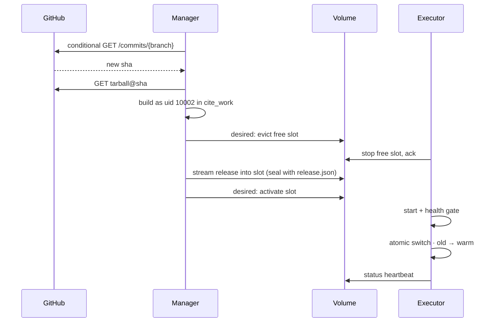

# How it works (blue-green)

Cite keeps **exactly two** built releases on the shared volume: slots `blue` and `green`. The manager decides *what* to deploy; the executor decides *whether a slot is healthy* and performs the atomic switch.



## Source

The manager downloads GitHub's source tarball for the pinned SHA. It does not run `git`. Git LFS pointers stay pointer files, and git submodules are not fetched.

## Slots and generations

- `control/desired.json` is the manager's intent (`generation`, `live_slot`, `action`).
- `status/executor.json` is the executor's reality (heartbeat ≤2 s).
- A slot is ignored until sealed (`release.json` written last).
- After cutover the previous slot stays **warm** for `CITE_WARM_GRACE` (default 24 h), then is stopped but files remain until the next deploy needs the slot.

## Failure modes (short)

| Event | Outcome |
|---|---|
| Build fails | Live untouched; nothing evicted |
| Health gate fails | Live untouched; candidate slot failed |
| Crash after switch | Automatic fallback to warm previous within `CITE_WATCH` |
| `cite rollback` | Instant if warm; otherwise executor cold-starts previous |

## Operator commands

```bash
docker compose exec manager cite status
docker compose exec manager cite poll
docker compose exec manager cite redeploy
docker compose exec manager cite rollback
docker compose exec manager cite restart-child
docker compose exec manager cite restart-executor   # exits → Compose relaunches
```

HTTPS is terminated **in front** of the executor — see [https.md](https.md).
